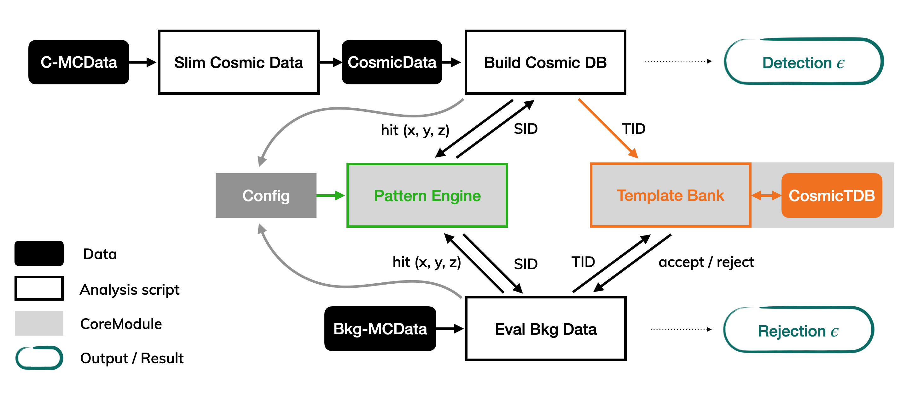

# The Cosmic Trigger

This simulation software project was developed within a Bachelorthesis carried out at the *Physikalisches Institut Uni Heidelberg* by Konstantin Neureither under the supervision of Prof. Dr. André Schöning in 2020. 

Its main goal is the implementation of a *Pattern Recognition Hardware Trigger* designed to detect cosmic muon tracks in the detector data at the Mu3e experiment. As an input the *Cosmic Trigger* uses Monte-Carlo Simulation data produced by the Mu3e Simualation package (including data from the Cosmic Simulation, the Cosmic Reconstruction and the Beam Simulation). 


### Module overview

The evaluation is split into two main analysis chains, the **Database Training** (or Database Building) aswell as the **Background Evaluation** where the false-positive rate of the trigger is examined using "normal" beam decay hits.

The Associative Memory, that is used as a hardware database in the future implementation as well as the Pattern Management is implemented in the Core Modules, the **Pattern Engine** and the **Template Bank**. In order to create the patterns from data of the pixel detector, pixels are grouped to *Super Pixels*. For a cosmic muon track, the super pixels that were hit by a cosmic are combined to a *Template*. To detect cosmics in the detector data, the occurence of super pixel hits according to these templates is looked up in that data.





### Project File Structure

* The software contains several subcomponents, which are
    * ```CTPreSlimData``` -- slims the cosmic muon TriRec output from the Mu3e simulation into a CosmicData file, which contains the connected and fitted cosmic muon tracks. It can append several MC simulation runs to one Cosmic dataset file.
    * ```CTCoreModules``` -- this folder contains the ```Pattern Engine``` class that creates and handles super pixel mappings as well as the ```Template Bank```, which simulates an associative memory.
    * ```CTCosPatTrain``` -- scripts to build a database from a cosmic dataset.
    * ```CTBgAna``` -- scripts to evaluate the false-positive trigger rate for non-cosmic hit frames. These scripts use a Mu3e simulation MC file as input and compute the full combinatorics in each frame, create Templates from it and test, if they occur in a given template bank.
    * ```CTPlottingScripts``` -- several scripts to create all different curves, such as ROC, SPC-T-Count fit, etc.

* Additional Folders
    * ```data``` a data directory is created. Here the template database and CosmicSIDs files are stored after they are created. Also the Slimmed Files are stored here and the MC simulation files can be provided in this directory as well.
      * Data provided by Mu3e Simulation:
        * ```BackgroundData``` Mu3e Simulation .root files containing beam simulations (![Bkg-MCData][Module Overview])
        * ```SimulationData``` Mu3e Simulation TriRec .root files containing reconstructed cosmic muon tracks (![Cosmic-MCData][Module Overview])
      * Data produced by scripts of Cosmic Trigger:
        * ```SlimmedData``` Slimmed versions of the Cosmic Simulation Data (![CosmicData][Module Overview])
        * ```TemplateData``` The Cosmic Template Database files (![CosmicTDB][Module Overview])
        * ```CosmicSIDtrackData``` Cosmic Track SIDs used for external signal efficiency benchmarking
    * ```util``` contains several functions that are used within several modules and scripts.
    * ```karimaki``` an implementation of a three dimensional helix fit, used in ```CTPreSlimData```.
    * ```root``` classes for ROOT file reading and writing.
    * ```Mu3eRecAcc``` Mu3e Reconstruction Accuracy produces analysis and control plots for a Mu3e simulation TriRec output in cosmic mode.
    * ```output``` this folder is created to store all PDF and .root files created by the Cosmic Trigger
      * ```0_RecAcc``` Reconstruction Accuracy output
      * ```1_SlimSegs``` Slim Segs Script Control Plots
      * ```2_DBTraining``` Training Control Plots, Training overview plots, training control data
      * ```3_DBEvaluation``` Bkg Evaluation output data, Bkg Eval Plots 
      * ```4_CosmicSIDs``` 
      * ```5_TemplateFilterEff```
      * ```6_Tests```
    